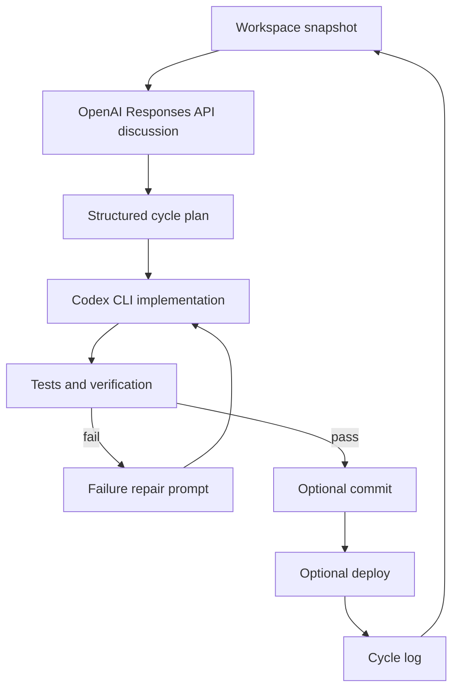

# Architecture

`ai-auto` separates judgement, code editing, and verification:

- OpenAI API: discusses the workspace and returns a structured cycle plan.
- Codex CLI: edits code using that cycle plan.
- Local command runner: runs tests, checks, Git status, commits, and deployment commands.

## Safety Model

- Deployment defaults to disabled.
- Codex defaults to workspace-write sandboxing.
- Human-controlled configuration owns the test, verify, and deploy commands.
- Planner-suggested test commands are ignored by default unless `allowPlannerCommandOverride` is enabled.
- Auto-commit defaults to disabled so the operator can review changes first.

## OpenAI API Shape

The planner uses the Responses API with JSON schema output. The planner must return:

- a concise discussion summary,
- whether code should be modified,
- a Codex implementation prompt,
- test and verification commands,
- a suggested commit message,
- a deployment recommendation.
