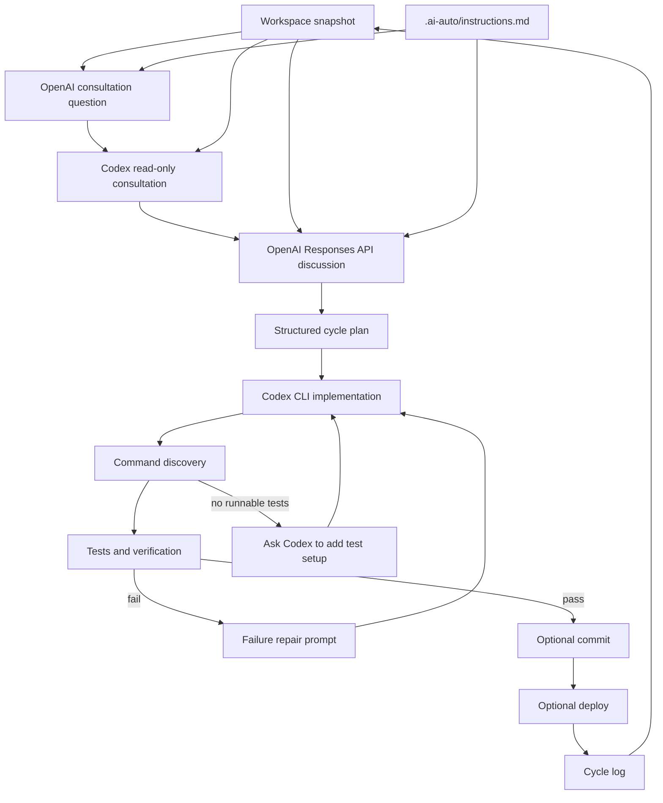

# Architecture

`ai-auto` separates judgement, code editing, and verification:

- OpenAI consultation question: writes the read-only question that should be asked to Codex.
- Codex CLI read-only consultation: answers that OpenAI-generated question by inspecting the project without editing it.
- OpenAI API: discusses the workspace with the Codex consultation result and returns a structured cycle plan.
- Codex CLI implementation: edits code using that cycle plan.
- Command discovery: detects project test and verification commands from standard project files.
- Local command runner: runs tests, checks, Git status, commits, and deployment commands.
- Natural-language instruction file: lets a running loop pick up new operator guidance between cycles.

## Safety Model

- Deployment defaults to disabled.
- Codex consultation defaults to read-only sandboxing.
- Codex implementation defaults to workspace-write sandboxing.
- Test and verification commands are auto-detected from standard project metadata.
- Human-controlled configuration can override test, verify, and deploy commands.
- Planner-suggested test commands are ignored by default unless `allowPlannerCommandOverride` is enabled.
- If runnable tests are missing and `commandDiscovery.requireTests` is true, the cycle cannot pass until Codex adds a minimal test setup.
- Running sessions can receive new natural-language instructions through `npm run instruct -- "..."`.
- Auto-commit defaults to disabled so the operator can review changes first.

## OpenAI API Shape

The planner uses the Responses API with JSON schema output. The planner must return:

- a concise discussion summary,
- whether code should be modified,
- a Codex implementation prompt,
- test intent (`use-existing`, `write-tests`, or `not-applicable`),
- test and verification commands,
- a suggested commit message,
- a deployment recommendation.
